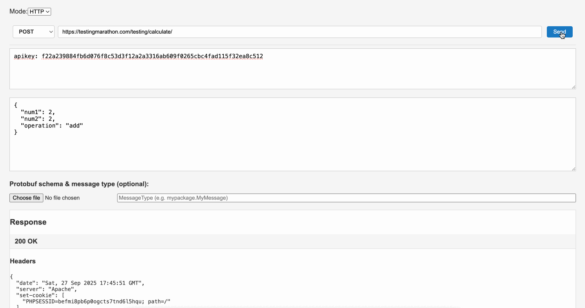

# 🔬 Rentgen

**Rentgen** is an API testing tool that works like an X-ray: it **exposes what’s really happening inside your APIs**.  

but built for:
- 🔌 **WebSockets (WSS)** — live bi-directional testing
- 📦 **Protobuf payloads** — load `.proto` schemas, encode requests, decode responses
- 🛠️ **Raw testing freedom** — send malformed or ugly payloads without restrictions
- 🏗️ Lightweight and no complex setup

---

## ✨ Why Rentgen?

Most API clients were designed for clean JSON over HTTP.
But real testing means more:
- Inspecting live WebSocket streams  
- Sending broken requests just to see what fails  
- Debugging binary formats like Protobuf
- Generating tests out of the box (in backlog)

**Rentgen** lets you do all of this in a familiar Postman-like interface.

---

## 🚀 Features

- 🌐 **HTTP/HTTPS support** — all standard methods (GET, POST, PUT, PATCH, DELETE, etc.)
- 🔄 **WebSocket testing** — connect, send, and inspect messages
- 🐛 **Protobuf integration** — load `.proto` schemas, encode requests, decode responses
- 🧪 **Send malformed payloads** — because this is testing, not production
- 🖥️ **Postman-like UI** — no learning curve, just start testing
- 🔒 **Ignore SSL validation** (for staging/test servers)

---

## 🏗️ Roadmap
- [ ] Tabbed requests / workspaces 
- [ ] Tests generation out of the box
- [ ] gRPC support  
- [ ] Plugins/extensions  

---

## 🎬 Demo


## 🔧 Installation

### Dev mode
```bash
git clone https://github.com/LiudasJan/Rentgen.git
cd rentgen
npm install
npm run electron:dev
---

## 🖥️ Building executables

## You can package Rentgen into a standalone app (.exe for Windows, .dmg for macOS, .AppImage for Linux).

### 1. Create build
npm run build

### 2. Package with Electron
npm run electron:build
