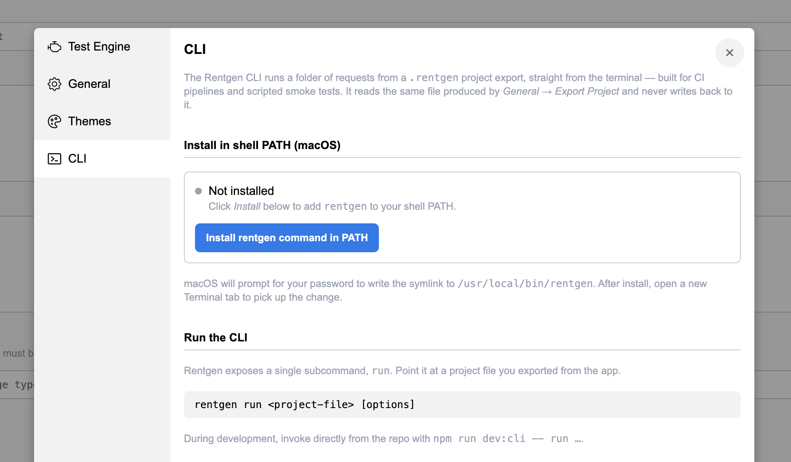
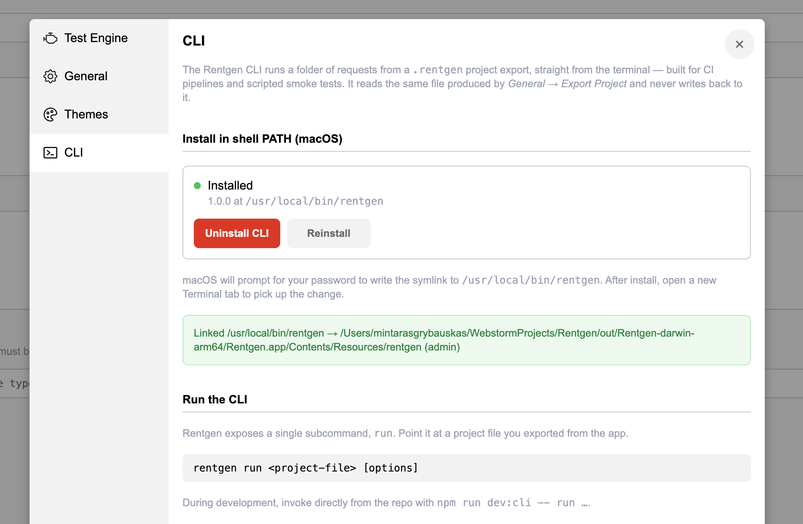
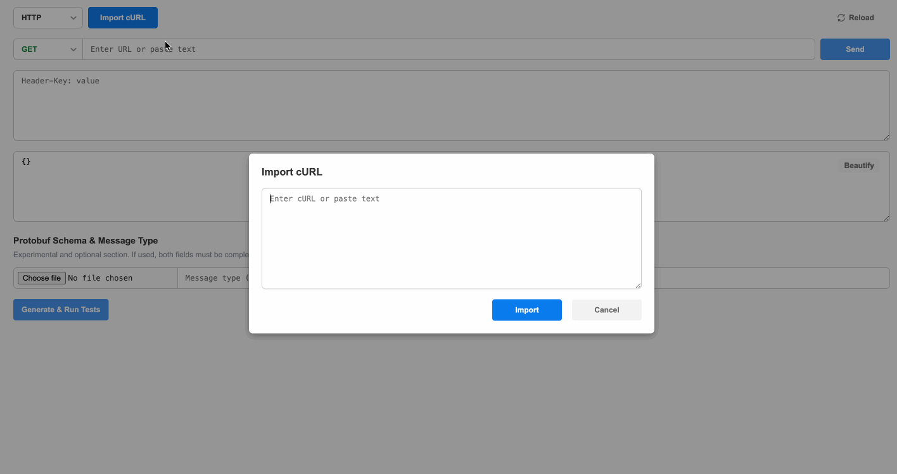

# 🔬 Rentgen

👉 Landing page: [rentgen.io](https://rentgen.io)
👉 Download: [Latest Release](https://github.com/Rentgen-io/Rentgen/releases/latest)

**Rentgen** - Automation before automation. Finding API bugs when you have no tests.

---

## Why Rentgen

Most API tools focus on _how to send requests_.
Rentgen focuses on **what your API does under pressure**.

From a single known-good request, Rentgen automatically checks:

- HTTP behavior
- error handling
- security headers
- edge cases that cause real production bugs
- performance insights

This is **behavior-first API testing**, not scripting.

---

## What Rentgen does

- Generate dozens of API tests from one request
- Detect misleading HTTP statuses (401 vs 403, 400 vs 413, etc.)
- Catch security and caching issues before production
- Test HTTP, WebSockets (WSS), and Protobuf APIs
- Run locally — your data never leaves your machine

---

## Real bugs, not theory

Rentgen has already found real issues in production APIs, including:

- broken payload size handling (DoS risk)
- missing cache-control on private data
- incorrect authorization responses
- unsafe CORS configurations

📖 Read real API Stories → [rentgen.io/api-stories](https://rentgen.io/api-stories)

---

## Get started (30 seconds)

1. Download the [latest Release](https://github.com/Rentgen-io/Rentgen/releases/latest)
2. Open Rentgen
3. Import a cURL
4. Run tests

That’s it. If something fails just copy bug report and share with a team.

## Run from the terminal — Rentgen CLI

The desktop installer also ships the `rentgen` CLI, so you can wire your `.rentgen` project exports straight into CI pipelines or local smoke-test scripts.

```sh
rentgen xray ./rentgen-project.rentgen --collection="Smoke Tests" --env=staging --fail-fast
```

- **Linux** users get the command automatically after `apt install` / `dnf install`.
- **macOS** and **Windows** users enable it with one click in **Settings → CLI → Install rentgen command in PATH**.

| Before install | After install |
|---|---|
|  |  |

Or skip the desktop install entirely and run from Docker — every release publishes a multi-arch image to `ghcr.io/rentgen-io/rentgen-cli` for use in CI/CD pipelines (GitHub Actions, GitLab CI, Bitbucket, Jenkins).

Full install + usage guide: [docs/CLI.md](./docs/CLI.md).

## 🎬 Demo



---

## Who this is for

- QA engineers
- API developers
- security-conscious teams
- anyone tired of “it works on my machine”

---

## Philosophy

> Boring bugs cost the most.

Rentgen exists because the most expensive API bugs are the ones nobody thinks to test.
